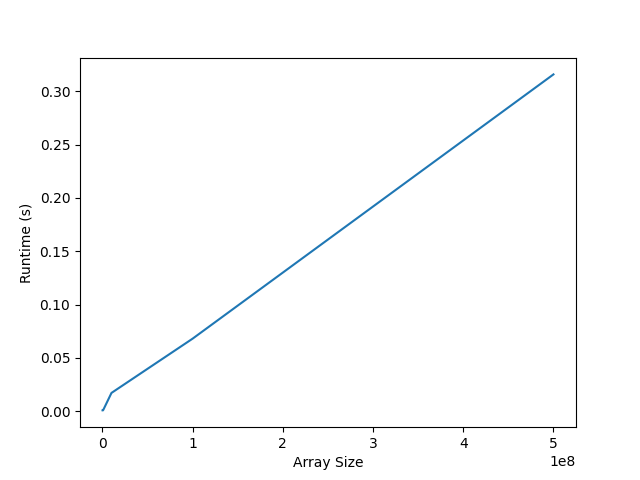

# Software Programming for Performance
>  **Name : Abhijnan Vegi**  
>  **Roll No : 2020101004**  
>  **Assignment 1**  


## Know your Computer
### CPU Specifications

|      Specification       |         Value         |
| :----------------------: | :-------------------: |
|           CPU            |      AMD Ryzen 7      |
|          Model           |         4800H         |
|     Frequency Range      |    2.9GHz - 4.2GHz    |
| Number of physical cores |           8           |
|      Hyperthreading      |          Yes          |
|         SIMD ISA         |         AVX2          |
|          Cache           | 512 KiB, 4 MiB, 8 MiB |
|     Memory Bandwidth     |      68.27 GB/s       |


#### Theoretical FLOPS
#### Whetstone benchmark
Running the whetstone benchmark with \\(10^6\\) loops gives a total of 6.25 GFLOPS.
```
Loops: 1000000, Iterations: 1, Duration: 16 sec.
C Converted Double Precision Whetstones: 6250.0 MIPS
```
Compiling the whetstone benchmark with the flag `-O3` we get the following result
```
Loops: 1000000, Iterations: 1, Duration: 4 sec.
C Converted Double Precision Whetstones: 25000.0 MIPS
```
Using the `icc` compiler instead of `gcc` gives us 10000 MIPS even with the `-O3` flag
#### My benchmark

### Memory Specifications

|      Specification       |   Value    |
| :----------------------: | :--------: |
|       Memory size        |   32 GiB   |
|           Type           |    DDR4    |
| Maximum Memory Bandwidth | 34.13 GB/s |

### Storage Specifications

1. **SSD**

   | Specification |  Value  |
   | :-----------: | :-----: |
   |     Size      | 256 GiB |
   |     Read      |         |
   |     Write     |         |

2. **HDD**

   | Specification | Value |
   | :-----------: | :---: |
   |     Size      | 1 TiB |
   |     Read      |       |
   |     Write     |       |


## Know your Cluster

1. ADA peak FLOPS : 70.66 TFLOPS
2. Abacus Peak FLOPS : 14 TFLOPS

## BLAS Problems

### 3.1 BLAS Level 1

#### xSCAL

- Operational Intensity : $0.25$ FLOP/Byte for `float`, $0.125$ FLOP/Byte for `double`

- Execution times ( input size : $1e^8$ )

  ```
  sscal with gcc : 50ms
  dscal with gcc : 100ms
  
  sscal with icc : 55ms
  dscal with icc : 110ms
  ```

- Baseline execution time : 400ms
  Best execution time : 50ms

- Speedup : $8\times$

- Baseline GFLOPS : 0.25
  Best GFLOPS : 2.0

- Optimization strategies : Vectorization

- Memory bandwidth : 8 GB/s

- The problem is CPU bound!


#### xDOT

- Operational Intensity : 0.25 FLOP/Byte for float and $0.125$ FLOP/Byte for double

- Execution times (Input size $1e^8$)

  ```
  sdot with gcc : 50ms
  sdot with icc : 55ms
  
  ddot with gcc : 75ms
  ddot with icc : 80ms
  ```

- Baseline execution time : 700ms
  Best execution time : 50ms

- Speedup : $14\times$

- Baseline GFLOPS : 0.3
  Best GFLOPS : 4 

- Optimization strategies : O3 and vectorization

- Memory bandwidth : 16 GB/s

- Problem is memory bound




#### XAXPY

- Operational Intensity

- Execution times (Input size $1e^8$)

  ```
  saxpy with gcc : 60ms
  saxpy with icc : 75ms
  
  daxpy with gcc : 115ms
  daxpy with icc : 130ms
  ```

- Baseline execution time : 650ms
  Best execution time : 60ms

- Speedup : $10\times$

- Baseline GFLOPS : 0.3

  Best GFLOPS : 3.5

- Optimization strategies : O3 and Vectorization

- Memory bandwidth : 16 GB/s

- Problem is memory bound


